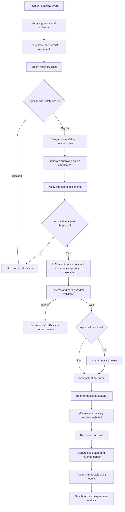

# AI Revenue Recovery — Revised Architecture

**Version:** 1.0  
**Scope:** Failed-subscription recovery MVP  
**Design objective:** Detect at-risk subscription revenue, diagnose the payment failure, select one bounded and economically justified intervention, execute it safely, and prove incremental recovered revenue with a complete audit trail.

> **Core principle:** Use AI where ambiguity and language understanding exist; use deterministic software where money, timing, eligibility, execution, and compliance are involved.

## 1. Executive design

The revised system is a bounded recovery control loop rather than an open-ended autonomous agent. It receives verified payment events, converts them into a canonical recovery case, evaluates eligibility and economic value, generates only approved action candidates, and allows the LLM to select or explain one candidate without inventing financial parameters.

The first release supports only failed subscription payments. The system uses one mocked payment gateway, one simulated messaging channel, a small transparent diagnosis model, deterministic policies, a bounded LLM decision step, and a treatment-versus-holdout measurement layer.

The four mandatory design changes are built into the architecture:

| Required change | Revised implementation |
|---|---|
| Deterministic recovery-policy and economic engine | A dedicated control plane generates eligible actions, applies hard rules, and calculates expected net recovery. |
| Bounded LLM candidate selection | The LLM selects only from precomputed candidates; it cannot invent retry timing, amount, method, frequency, or thresholds. |
| Incremental recovered-revenue measurement | Treatment and holdout cohorts estimate recovery lift rather than attributing every post-action payment to AI. |
| Focused failed-subscription MVP | Other workflows and channels are deferred until the core recovery loop is proven. |

## 2. Revised end-to-end architecture



## 3. Responsibility boundaries

The system has five logical planes. The boundaries are intentional and must not be collapsed into a single agent.

| Plane | Responsibilities | LLM authority |
|---|---|---|
| Ingestion plane | Verify events, normalize schema, deduplicate, persist raw input | None |
| Prediction plane | Diagnose decline reason, estimate retry success, produce reason codes | None for structured prediction |
| Policy and economic control plane | Enforce consent, disputes, cooldowns, contact caps, action eligibility, retry budget, and expected-value thresholds | None |
| Decision and communication plane | Select one approved candidate, personalize approved copy, extract promise-to-pay text | Bounded candidate selection and language only |
| Execution and measurement plane | Execute idempotently, reconcile outcomes, update ledger, calculate incremental recovery, audit every transition | None |

### Authority precedence

When sources disagree, the following order always applies:

```text
Hard-coded safety rules
    > tenant configuration
    > approved policy records
    > retrieved templates and historical context
    > LLM output
    > customer-provided text
```

Customer messages are untrusted input. They may be analyzed for intent or promise-to-pay information, but they can never override safety rules or execution policy.

## 4. Canonical domain model

### 4.1 Recovery event

All incoming events must be normalized into a common structure.

```json
{
  "event_id": "evt_01J...",
  "event_type": "subscription.payment_failed",
  "occurred_at": "2026-08-23T10:30:00Z",
  "source": "mock_gateway",
  "customer_id": "cus_123",
  "subscription_id": "sub_456",
  "amount_minor": 149900,
  "currency": "INR",
  "decline_code": "insufficient_funds",
  "payment_method_type": "card",
  "payment_method_fingerprint": "pm_fp_789",
  "attempt_number": 1,
  "metadata": {}
}
```

The raw event is immutable. Normalized records may be enriched, but the original payload must remain available for replay and audit.

### 4.2 Recovery case

A recovery case represents the complete lifecycle for one customer and subscription episode.

```json
{
  "case_id": "case_001",
  "customer_id": "cus_123",
  "subscription_id": "sub_456",
  "principal_amount_minor": 149900,
  "currency": "INR",
  "state": "DIAGNOSED",
  "cohort": "treatment",
  "risk_tier": "standard",
  "contact_count_week": 0,
  "retry_count_episode": 1,
  "last_contact_at": null,
  "opted_out": false,
  "disputed": false,
  "policy_version": "policy_2026_08_01",
  "model_version": "diagnosis_v1",
  "created_at": "2026-08-23T10:30:01Z",
  "updated_at": "2026-08-23T10:30:02Z"
}
```

### 4.3 Candidate action

The candidate generator, not the LLM, creates action parameters.

```json
{
  "candidate_id": "cand_24h_retry",
  "action_type": "retry_payment",
  "parameters": {
    "delay_hours": 24,
    "payment_method_fingerprint": "pm_fp_789",
    "amount_minor": 149900
  },
  "eligibility": {
    "allowed": true,
    "reason_codes": ["TRANSIENT_OR_FUNDS_DECLINE", "WITHIN_RETRY_BUDGET"]
  },
  "economics": {
    "success_probability": 0.42,
    "expected_gross_recovery_minor": 62958,
    "estimated_action_cost_minor": 100,
    "risk_penalty_minor": 0,
    "expected_net_recovery_minor": 62858
  }
}
```

The LLM receives candidate IDs and bounded metadata. It does not receive tools that permit arbitrary payment operations.

## 5. State machine

Every case follows an explicit, replayable state machine.

```text
RECEIVED
  → NORMALIZED
  → ELIGIBILITY_CHECKED
  → DIAGNOSED
  → CANDIDATES_GENERATED
  → ACTION_SCORED
  → DECISION_PENDING
  → VALIDATED
  → ACTION_SCHEDULED
  → ACTION_EXECUTED
  → AWAITING_OUTCOME
  → RECOVERED
```

Terminal states are:

```text
STOPPED_BY_POLICY
ESCALATED_TO_HUMAN
CUSTOMER_OPTED_OUT
CUSTOMER_DISPUTED
EXPIRED
FAILED_EXECUTION
```

Invalid transitions must be rejected. For example, a case in `RECOVERED` cannot transition back to `ACTION_SCHEDULED`, and a case in `CUSTOMER_DISPUTED` cannot execute a new recovery action.

## 6. Detection and reliability layer

The ingestion service performs the following operations in order:

1. Verify the gateway signature or trusted source credential.
2. Validate the event against the canonical schema.
3. Use `event_id` as an idempotency key.
4. Persist the raw event before downstream processing.
5. Create or update the corresponding recovery case.
6. Reject or quarantine malformed events without executing an action.

The service must handle duplicate, delayed, and out-of-order events. Payment success events are authoritative for recovery status and must reconcile any scheduled action before another action is allowed.

The MVP should include a dead-letter queue or equivalent error table and a replay command for failed events.

## 7. Diagnosis layer

The MVP diagnosis layer combines deterministic mappings with one transparent classifier.

| Input signal | Output |
|---|---|
| Gateway decline code | Primary failure category |
| Payment method type | Card, bank debit, wallet, or other |
| Historical attempts | Retry count and prior outcomes |
| Time since last attempt | Timing feature |
| Customer payment history | Prior success and failure pattern |
| Subscription value tier | Recovery priority |

The classifier produces:

```json
{
  "root_cause": "insufficient_funds",
  "success_probability_now": 0.18,
  "reason_codes": ["DECLINE_CODE_MATCH", "LOW_RECENT_BALANCE_SIGNAL"],
  "recommended_retry_window": "24_to_72_hours",
  "confidence": 0.84,
  "model_version": "diagnosis_v1"
}
```

The retry window is a bounded recommendation. The exact delay is selected from the approved policy candidate set. If the model confidence is below the configured threshold, the system falls back to deterministic rules or human review.

The MVP should report calibration and confusion metrics for the model, but should not claim production performance from synthetic data.

## 8. Recovery Policy and Economic Engine

This is the central addition to the original architecture.

### 8.1 Eligibility checks

Before candidate generation, the engine checks:

| Rule | Example behavior |
|---|---|
| Opt-out | Stop all customer-facing outreach immediately |
| Dispute | Stop automated recovery and escalate or close according to policy |
| Legal or account hold | Block action and route to an operator |
| Weekly contact cap | Block communication after the configured maximum |
| Cooldown | Block another channel action inside the cooldown window |
| Retry cap | Block payment retry after the episode limit |
| Amount integrity | Candidate amount must equal the authorized recoverable amount |
| Subscription status | Do not recover a canceled or already-paid subscription |
| Minimum economic value | Stop if expected recovery is below the action threshold |

### 8.2 Candidate generation

Candidates are created by deterministic code using policy configuration. Example candidates include:

```text
retry_after_24_hours
retry_after_72_hours
send_approved_email_template_01
offer_approved_alternate_payment_method
escalate_to_human
stop_pursuit
```

Each candidate contains fixed parameters, eligibility results, reason codes, and an economic estimate.

### 8.3 Expected-value scoring

For each eligible candidate:

```text
expected_net_recovery
= calibrated_probability_of_incremental_success × recoverable_amount
  − action_cost
  − operational_cost
  − risk_penalty
```

The engine must apply a minimum expected-value threshold and a maximum-risk threshold. A candidate may be financially attractive but still prohibited by consent, dispute, contact, or account policy.

The engine returns one of three outcomes:

```text
ACTIONABLE_CANDIDATES
NO_ACTION_ABOVE_THRESHOLD
BLOCKED_BY_POLICY
```

## 9. Bounded LLM decision layer

The LLM is used only after candidate generation and economic scoring.

### 9.1 Input to the LLM

The prompt should contain:

- diagnosis reason codes;
- calibrated prediction summary;
- customer interaction summary;
- approved policy context;
- approved message templates;
- candidate IDs and fixed parameters;
- explicit instruction to select exactly one candidate;
- prohibition against creating new actions or changing parameters.

### 9.2 Required structured output

```json
{
  "selected_candidate_id": "cand_email_template_01",
  "message_template_id": "email_template_01",
  "personalization_variables": {
    "customer_first_name": "Asha",
    "payment_amount_display": "₹1,499",
    "support_link": "https://example.test/support"
  },
  "decision_reason": "The retry candidate has lower expected value than a single approved reminder under the current cooldown policy.",
  "confidence": 0.88
}
```

The LLM must not return arbitrary delay, amount, payment method, channel, contact count, escalation threshold, or tool call parameters.

### 9.3 Failure behavior

If the LLM times out, returns invalid JSON, references an unknown candidate, changes fixed parameters, or violates the template constraints, the system must:

1. record the failure;
2. reject the response;
3. use the deterministic fallback policy or route to human review;
4. continue the audit trail;
5. never execute an unvalidated action.

## 10. Execution layer

The executor is deterministic, idempotent, and separate from the LLM.

| Adapter | MVP behavior |
|---|---|
| Payment adapter | Mock retry endpoint with idempotency key and configurable outcome |
| Messaging adapter | Simulated email or SMS dispatch with delivery status |
| Human escalation adapter | Creates a review ticket with full case context |
| Outcome adapter | Receives success, failure, delivery, or response events |

Each execution request includes:

```json
{
  "execution_id": "exec_001",
  "case_id": "case_001",
  "candidate_id": "cand_24h_retry",
  "idempotency_key": "case_001:cand_24h_retry:v1",
  "policy_version": "policy_2026_08_01",
  "approved_at": "2026-08-23T10:31:00Z"
}
```

A repeated request with the same idempotency key must return the previous result rather than executing again.

## 11. Incremental revenue measurement

The measurement layer is the fourth mandatory change.

### 11.1 Cohort assignment

At case creation, eligible cases are deterministically assigned to a treatment or holdout cohort using a stable hash of `customer_id` and `case_id`. The assignment is persisted and never changed during the episode.

```text
stable_hash(customer_id + case_id) % 100
  0–79  → treatment
  80–99 → holdout
```

The holdout group must not receive automated recovery outreach during the experiment window. Safety, opt-out, dispute, and legal rules still apply to both groups.

### 11.2 Ledger fields

```json
{
  "ledger_entry_id": "ledger_001",
  "case_id": "case_001",
  "cohort": "treatment",
  "amount_recovered_minor": 149900,
  "recovered_at": "2026-08-24T09:00:00Z",
  "action_id": "action_001",
  "attribution_window_hours": 72,
  "attribution_status": "observed_after_action",
  "action_cost_minor": 100
}
```

### 11.3 Dashboard metrics

The dashboard must separate observed results from estimated causal impact:

```text
observed treatment recovery rate
observed holdout recovery rate
estimated recovery lift
estimated incremental recovered ₹
total observed recovered ₹
average time to recovery
cost to recover ₹1
policy stop rate
human escalation rate
invalid-LLM-response rate
execution failure rate
```

For a synthetic demo, use language such as **“estimated incremental recovered revenue in the simulated batch.”** Do not present synthetic results as real-world performance.

## 12. Audit trail

Every meaningful transition creates an append-only audit event.

```json
{
  "audit_id": "audit_001",
  "case_id": "case_001",
  "event_type": "ACTION_VALIDATED",
  "actor_type": "policy_engine",
  "actor_version": "policy-engine-v1",
  "payload": {
    "candidate_id": "cand_email_template_01",
    "reason_codes": ["WITHIN_CONTACT_CAP", "ABOVE_VALUE_THRESHOLD"]
  },
  "created_at": "2026-08-23T10:31:02Z"
}
```

A case timeline must make the following visible:

```text
raw event
→ normalized event
→ eligibility result
→ diagnosis
→ candidates and scores
→ LLM response
→ validator result
→ execution request
→ gateway or delivery outcome
→ ledger entry
→ final state
```

The audit log must include model version, policy version, template version, prompt version, actor, timestamps, and reason codes.

## 13. MVP data tables

| Table | Purpose |
|---|---|
| `raw_events` | Immutable incoming payloads and verification status |
| `recovery_cases` | Current state and customer episode fields |
| `diagnoses` | Model output, confidence, reason codes, and version |
| `action_candidates` | Eligible actions, fixed parameters, and economics |
| `decisions` | Bounded LLM output, validator result, and fallback status |
| `executions` | Idempotent action requests and adapter responses |
| `outcomes` | Payment, delivery, response, and reconciliation events |
| `revenue_ledger` | Observed and incremental recovery calculations |
| `audit_events` | Append-only event history |
| `policies` | Versioned thresholds, caps, cooldowns, and action definitions |
| `templates` | Approved channel, language, and tone templates |

## 14. MVP demo scenarios

The demo should run a fixed batch containing these cases:

| Scenario | Expected result |
|---|---|
| Transient gateway failure | Candidate retry is selected and later succeeds |
| Insufficient funds | Approved delayed retry or reminder is selected |
| Expired payment method | Alternate-method or human escalation candidate is selected |
| Customer has reached contact cap | Workflow stops automatically with a reason code |
| Customer has opted out | No message or retry is executed |
| Customer disputes the charge | Automated recovery stops and case is escalated |
| LLM returns malformed output | Response is rejected and deterministic fallback is used |
| Duplicate gateway event | Event is ignored after audit logging; no duplicate action occurs |
| Holdout case later pays | Payment is recorded but not attributed to AI intervention |

## 15. Recommended implementation sequence

### Phase 1: Reliable core

Implement canonical events, case creation, state transitions, idempotency, raw-event persistence, and mock gateway outcomes.

### Phase 2: Policy control

Implement eligibility checks, contact caps, cooldowns, opt-outs, disputes, candidate generation, expected-value scoring, and the deterministic fallback policy.

### Phase 3: AI assistance

Add the diagnosis classifier, bounded LLM candidate selection, approved-template personalization, and promise-to-pay extraction if time remains.

### Phase 4: Measurement and demo

Add stable treatment/holdout assignment, the revenue ledger, case-level audit view, dashboard metrics, and the required stop/escalation/fallback scenarios.

## 16. Deferred features

The following features are deliberately excluded from the first release:

- voice recovery;
- WhatsApp integration;
- B2B overdue receivables;
- checkout-abandonment workflows;
- multi-agent orchestration;
- reinforcement learning or contextual bandits;
- real-money payment execution;
- automatic interpretation of arbitrary policy documents;
- unrestricted customer-facing generation.

These can be added later through adapters and new policy definitions without changing the core case, policy, execution, and measurement contracts.

## 17. Final architecture decision

The revised system is an **AI-assisted, policy-controlled revenue recovery platform**. Its intelligence is distributed intentionally:

- the diagnosis model predicts structured payment-failure behavior;
- the policy engine decides what is allowed and economically worthwhile;
- the LLM handles bounded judgment and communication;
- the executor performs only validated, idempotent actions;
- the measurement layer proves observed and incremental recovered revenue;
- the audit layer makes every decision replayable.

This architecture is optimized for the challenge because it demonstrates the complete loop from **detection to diagnosis, intervention, execution, recovery measurement, compliant stopping, escalation, and proof**—without pretending that an LLM should control money or policy.
